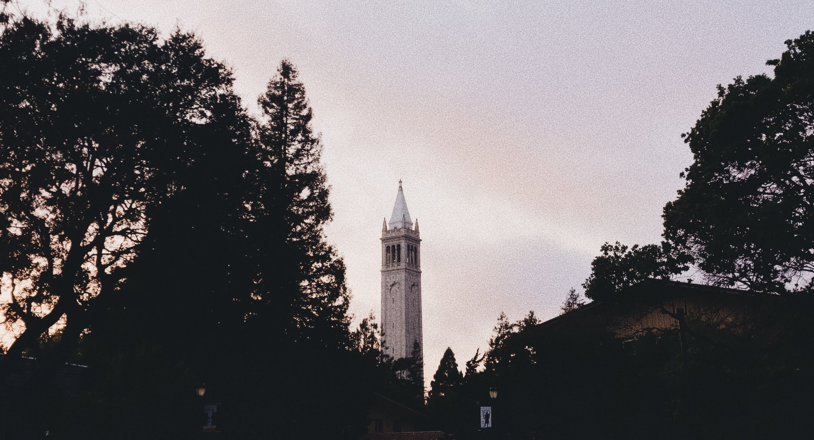

**Hello!**

I’m Arav—a first-year CS student at UC Berkeley. Welcome to my first ever blog post, which will probably be entirely dedicated towards what kinds of things I’ve been up to recently.

I’m about a month into my first semester at university, and yeah, being a Berkeley student is no joke. But, like most things, you get out what you put in in the first place. Admittedly, I tend to avoid all things electronics, circuits, and hardware, but I couldn’t really dodge that here :) Thankfully, though, my first few weeks in my electrical engineering / systems design course has shown me how pervasive the applications actually are and how linear algebra can be used to model things in the real world. Definitely having a change of heart. I’ve also been spending hours on end breaking down the anatomy of recursive functions, trees, and higher-order functions in my computer science course, and perpetually doing problem sets to try to unlock the key to gaining mathematical maturity.

Outside of just coursework, I’ve been fortunate enough to get involved with academic research, which is incredibly exciting! I work as an undergraduate research assistant in the Haas School of Business, implementing computational linguistics tools such as natural language processing (specifically latent semantic analysis) to analyze large quantities of text, and to create measures of similarity between corporate regulation documents. For more details about my research, stay tuned!

I hope to leave Berkeley with an inquisitive approach to industry problems. My tentative plans for the future are subject to change, and I honestly hope they change, just to end up in a different place than I had envisioned. Maybe I’ll switch to something in finance. Maybe I’ll go down the academic route and become a Ph.D. and researcher. Either way, I know that whatever I’m going to be doing at the very end will automatically be awesome because of Cal :)

Thanks for tuning in! Signing off ’til next time…

> ~ arav watwani

